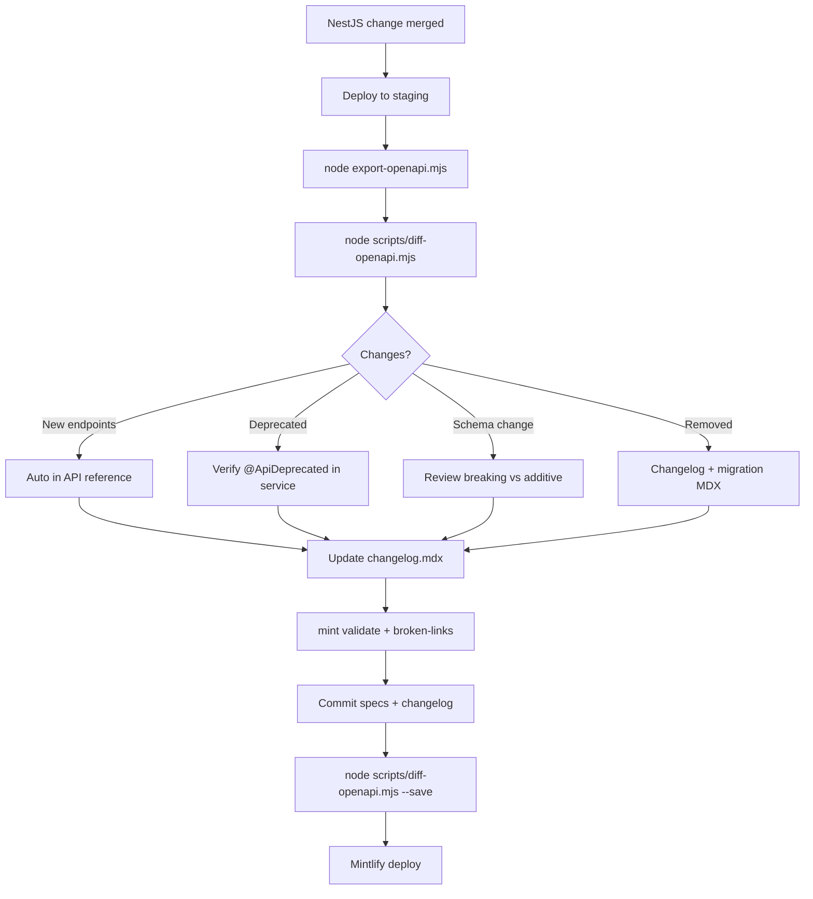

# API change strategy

Fluide Connect docs are generated from **OpenAPI** exported off the beta gateway. API changes flow from NestJS services → Swagger → export → diff → changelog → publish.

## Change types and who owns what

| Change | Detected by | Documented in | Owner |
| --- | --- | --- | --- |
| **New endpoint** | OpenAPI diff | Auto-generated API page + optional changelog entry | Service team exports spec |
| **Deprecated endpoint** | `deprecated: true` in OpenAPI | Deprecated label in API reference + changelog | Service team marks in NestJS |
| **Removed endpoint** | OpenAPI diff | Changelog (breaking) + migration note | Platform + service team |
| **New/changed response fields** | OpenAPI diff (schema fingerprint) | Updated schema in API reference + changelog if breaking | Service team updates DTOs |
| **New product** | Manual | `docs.json`, overview MDX, enrichment | Connect docs maintainer |
| **Behavior-only change** | Not auto-detected | Operation `description` in Swagger or enrichment | Service team |

## The update loop



## 1. Mark changes in the service (source of truth)

Every API change should start in the **NestJS service** Swagger annotations:

### New endpoints

- Add `@ApiOperation({ summary, description })` with a clear summary
- Use `@ApiTags()` so the endpoint lands in the right sidebar group
- Define DTOs with `@ApiProperty()` so response schemas export correctly

### Deprecated endpoints

Use `@ApiDeprecated()` on the controller method. NestJS Swagger emits `deprecated: true`, and Mintlify shows a **Deprecated** label in the sidebar and on the page ([OpenAPI setup](https://www.mintlify.com/docs/api-playground/openapi-setup)).

```typescript
@Get('legacy-employees')
@ApiDeprecated()
@ApiOperation({
  summary: 'List employees (legacy)',
  description: 'Deprecated — use GET /api/v1/hr/employees instead. Removal planned 2026-Q3.',
})
legacyList() { ... }
```

Always include **what to use instead** and **removal timeline** in the operation description.

### Internal or non-developer endpoints

Hide from Connect navigation with `x-hidden: true` on the operation (post-process in export, or `@ApiExcludeEndpoint()` in NestJS). See [Manage page visibility](https://www.mintlify.com/docs/api-playground/managing-page-visibility).

### Breaking response changes

- Prefer **additive** changes (new optional fields) — OpenAPI schema updates automatically
- For **breaking** changes (removed/renamed required fields, type changes): document in `changelog.mdx` and add a short migration note in the product guide or operation description

## 2. Export from staging

After the service is deployed to `https://staging.api.fluidehr.com`:

```bash
node export-openapi.mjs
```

This overwrites `openapi/*.json`, applies `openapi/enrichment.mjs`, and sets the playground base URL to staging.

## 3. Diff against the last release baseline

```bash
node scripts/diff-openapi.mjs
```

Reports per service:

- **+ New endpoints** — appear in API reference after deploy; no action unless public announcement needed
- **- Removed endpoints** — **breaking**; require changelog entry and migration guidance
- **! Newly deprecated** — verify `@ApiDeprecated()` and description in the service
- **~ Schema changes** — review whether additive or breaking

Machine-readable output for CI:

```bash
node scripts/diff-openapi.mjs --json
```

### Refresh baseline after a docs release

Once changelog is updated and specs are committed:

```bash
node scripts/diff-openapi.mjs --save
```

This copies current `openapi/*.json` to `openapi/.baseline/` for the next diff cycle.

## 4. Changelog (developer-facing)

Maintain **`changelog.mdx`** with Mintlify `<Update>` blocks for each beta release. Document:

- New endpoints or products (link to API reference group)
- Deprecated endpoints (replacement path + sunset date)
- Breaking schema or behavior changes (before/after examples)
- Non-breaking additions (new optional fields)

Developers subscribe via RSS at `/changelog/rss.xml` ([Mintlify changelogs](https://www.mintlify.com/docs/create/changelogs)).

### Breaking vs non-breaking

| Breaking | Non-breaking |
| --- | --- |
| Endpoint removed | New endpoint added |
| Required field added/removed/renamed | New optional response field |
| Response type changed | New enum value |
| Auth requirements tightened | New deprecated label (old path still works) |
| Default behavior changed | New tag group in API reference |

## 5. CI gate (recommended)

On PRs that touch `openapi/*.json`:

```bash
node scripts/diff-openapi.mjs --json > /tmp/api-diff.json
npx mint validate
npx mint broken-links
```

Optional: fail CI if removed endpoints are detected without a changelog update in the same PR.

Nightly on `main`:

1. `node export-openapi.mjs`
2. `node scripts/diff-openapi.mjs`
3. Open a PR if diff is non-empty

## 6. Versioning today (beta)

Fluide is in **beta** with a single API version (`/api/v1/*`). We do not maintain separate Mintlify version tabs yet.

When GA approaches:

- Add Mintlify **Versions** navigation for `v1` / `v2`
- Keep deprecated v1 endpoints visible with labels until sunset
- Export separate spec files per major version if services ship `/api/v2`

## Quick reference

| Task | Command / file |
| --- | --- |
| Export latest specs | `node export-openapi.mjs` |
| See what changed | `node scripts/diff-openapi.mjs` |
| Lock in a release baseline | `node scripts/diff-openapi.mjs --save` |
| Product copy / tag descriptions | `openapi/enrichment.mjs` |
| Developer release notes | `changelog.mdx` |
| Hide internal endpoints | `x-hidden: true` or `@ApiExcludeEndpoint()` |
| Mark deprecated | `@ApiDeprecated()` + description with replacement |
