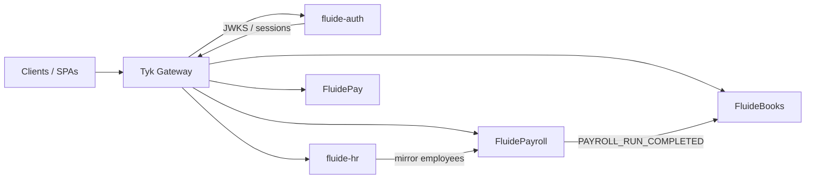

# Architecture

The Fluide Suite is a **microservices ERP** behind **Tyk** (`FluideGateway`). Each service owns a PostgreSQL database and exposes HTTP APIs plus optional TCP microservice transport.

## Service map

| Service | Default HTTP port | Database | Primary role |
| --- | --- | --- | --- |
| fluide-auth | 3000 | `fluide_auth` | Identity, orgs, RBAC, SSO |
| fluide-hr | 3000 / 3001 | `fluide_hr` | Employees, leave, performance, compliance |
| FluidePayroll | 5051 | `fluide_payroll` | Payroll runs, payslips |
| FluidePay | 5058 | `fluide_pay` | Wallets, transactions, providers |
| FluideBooks | 5052 | `fluide_books` | GL, journals, invoices, payroll mappings |

<Note>
Ports vary by environment. Check each service `.env.example` and `ochestrator/docker/docker-compose.yml`.
</Note>

## Shared patterns

- **NestJS** for HTTP APIs and Swagger/OpenAPI
- **Gateway user context**: authenticated requests include enriched user data (see [gateway and auth](/platform/gateway-and-auth))
- **Kafka** for async email, payroll events, and domain lifecycle
- **Prometheus** metrics at `/metrics` on most services

## Documentation sources

| Type | Location |
| --- | --- |
| This site | `Fluide/FE/FluideConnect` (Mintlify) |
| Service READMEs | Each service repo root |
| Tyk apps | `FluideGateway/apps/*.json` |
| OpenAPI export | `scripts/export-openapi.mjs` |
