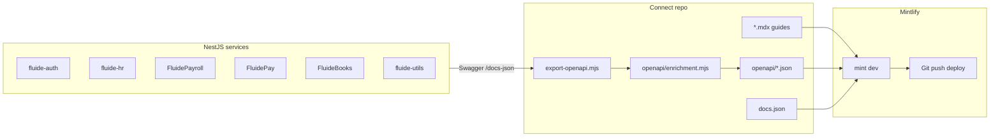

# Documentation pipeline

Fluide Connect uses **Mintlify** with a hybrid model: hand-written guides in MDX, auto-generated endpoint pages from OpenAPI, and a single enrichment layer for product descriptions.

## Architecture



## What is generated vs hand-written

| Layer | Source | Updates when |
| --- | --- | --- |
| **Endpoint pages** | `openapi/*.json` via Mintlify | Re-export specs from services |
| **Product API intros** | `api-reference/*.mdx` + `openapi/enrichment.mjs` | Edit MDX or enrichment, re-run export |
| **Guides** | `getting-started/`, `auth/`, `hr/`, etc. | Manual MDX edits |
| **Code examples in playground** | Mintlify autogenerate from OpenAPI + `docs.json` `api.examples` | Spec or `docs.json` change |
| **Navigation** | `docs.json` | Manual when adding products or pages |

## Day-to-day workflow

### 1. Export OpenAPI from the beta gateway

By default, specs are pulled from **staging**:

```bash
node export-openapi.mjs
```

Source: `https://staging.api.fluidehr.com/api/v1/docs/{auth,hr,payroll,payments,accounting,utils}/swagger-ui-init.js`

Override the gateway host or a single service:

```bash
FLUIDE_API_BASE_URL=https://staging.api.fluidehr.com node export-openapi.mjs
OPENAPI_HR_URL=https://staging.api.fluidehr.com/api/v1/docs/hr-json node export-openapi.mjs
```

For local stack development, start Tyk on `localhost:8080` and set `FLUIDE_API_BASE_URL=http://localhost:8080`.

This fetches Swagger, sanitizes NestJS-only fields Mintlify rejects, and applies `openapi/enrichment.mjs` (product descriptions, tag descriptions, health/metrics copy).

### 2. Re-apply enrichment without re-fetching

When you only change copy in `openapi/enrichment.mjs`:

```bash
node scripts/enrich-openapi.mjs
```

### 3. Preview locally

```bash
npm run dev
```

Docs preview: `http://localhost:3001` (Mintlify). App: `http://localhost:3000`.

### 4. Validate before merge

```bash
npx mint broken-links
npx mint validate
```

## Handling API changes

When services add endpoints, deprecate routes, or change response schemas, follow the **[API change strategy](/platform/api-change-strategy)**:

1. Mark deprecations with `@ApiDeprecated()` in NestJS (Mintlify shows a Deprecated label)
2. `node export-openapi.mjs` — pull latest from staging
3. `node scripts/diff-openapi.mjs` — compare to `openapi/.baseline/`
4. Update **`changelog.mdx`** for breaking or deprecated changes
5. `node scripts/diff-openapi.mjs --save` — lock baseline after release

## CI and Mintlify deployment

**Mintlify builds [Fluid-Technologies/docs](https://github.com/Fluid-Technologies/docs)** (`main`) — not FluideConnect. Author here; **publish** via sync.

| Step | Repo |
| --- | --- |
| Edit MDX, export OpenAPI | **FluideConnect** |
| `sync-to-docs-repo.mjs` + push | **[Fluid-Technologies/docs](https://github.com/Fluid-Technologies/docs)** |
| Mintlify deploy | GitHub App on `docs` `main` |

CI (`.github/workflows/docs-sync.yml`):

| Trigger | What happens |
| --- | --- |
| **PR** | Export from staging → fail if `openapi/` not committed |
| **Merge FluideConnect `main`** | Export → sync → push to `docs` (needs `DOCS_REPO_PAT`) |
| **Schedule** | Open OpenAPI PR on FluideConnect |

See **[Mintlify deployment](/platform/mintlify-deployment)** for PAT setup and manual sync commands.

## Enrichment single source of truth

Edit **`openapi/enrichment.mjs`** to change:

- `PRODUCT_META` — `info.description` per service
- `TAG_DESCRIPTIONS` — sidebar group descriptions (Health, Prometheus, Documents, …)
- `OPERATION_PATCHES` — endpoint-level descriptions for operations/monitoring routes

Product overview pages in **`api-reference/*.mdx`** hold the narrative context (integration flows, monitoring tables). Keep enrichment and MDX in sync when adding a new product.

## Adding a new product

1. Add NestJS Swagger export URL to `SOURCES` in `export-openapi.mjs`
2. Add an entry to `PRODUCT_META` in `openapi/enrichment.mjs`
3. Create `api-reference/<product>.mdx` and `<product>/overview.mdx`
4. Register in `docs.json` under **Products** and **API reference** tabs
5. Run export + validate

## Code example languages

`docs.json` configures playground snippets:

```json
"examples": {
  "languages": ["bash", "node"],
  "autogenerate": true
}
```

Mintlify maps `bash` → cURL and `node` → Node.js `fetch`. For custom samples per endpoint, add `x-codeSamples` to the OpenAPI operation.
