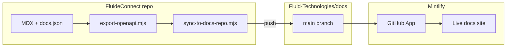

# Mintlify deployment

Mintlify is configured to build from **[Fluid-Technologies/docs](https://github.com/Fluid-Technologies/docs)** on branch **`main`** — not from the FluideConnect app repo.

| Repo | Role |
| --- | --- |
| **[Fluid-Technologies/docs](https://github.com/Fluid-Technologies/docs)** | **Deploy target** — Mintlify GitHub App watches this repo |
| **[Fluid-Technologies/FluideConnect](https://github.com/Fluid-Technologies/FluideConnect)** | **Authoring** — Next.js portal + Mintlify MDX/OpenAPI source |



## Mintlify dashboard (already configured)

From **Git Settings** in [app.mintlify.com](https://app.mintlify.com):

| Setting | Value |
| --- | --- |
| Organization | `fluid-technologies` |
| Repository | `docs` |
| Branch | `main` |
| Subdirectory | off (`docs.json` at repo root) |

The GitHub App is **Active** on the org. Pushes to `Fluid-Technologies/docs` `main` trigger deploys. **Free plan — no API keys.**

If deploy does not run, use the dashboard **Deploy** button ([manual deploy](https://www.mintlify.com/docs/deploy/deployments)).

## Publishing flow

### Automatic (CI)

On merge to **FluideConnect** `main`, `.github/workflows/docs-sync.yml`:

1. `node export-openapi.mjs` — pull specs from `https://staging.api.fluidehr.com/api/v1/docs/*`
2. `node scripts/sync-to-docs-repo.mjs` — copy Mintlify files into a checkout of `Fluid-Technologies/docs`
3. Push to `docs` `main` → Mintlify rebuilds

**Required GitHub secret** on **FluideConnect** (Settings → Secrets → Actions):

| Secret | Purpose |
| --- | --- |
| `DOCS_REPO_PAT` | Fine-grained PAT with **Contents: Read and write** on `Fluid-Technologies/docs` only |

Create at GitHub → Settings → Developer settings → Fine-grained tokens. Without this secret, export still runs but publish is skipped.

### Manual (local)

```bash
# In FluideConnect
node export-openapi.mjs
git clone https://github.com/Fluid-Technologies/docs.git /tmp/fluide-docs
node scripts/sync-to-docs-repo.mjs /tmp/fluide-docs
cd /tmp/fluide-docs
git add -A && git commit -m "chore: sync docs from FluideConnect" && git push
```

Mintlify deploys within a minute or two of the push to `docs` `main`.

## What gets synced

`scripts/sync-to-docs-repo.mjs` copies:

- `docs.json`, all `*.mdx` content trees (`getting-started/`, `auth/`, `api-reference/`, …)
- `openapi/` (exported specs + `.baseline/` + `enrichment.mjs`)
- `public/` (logos referenced in `docs.json`)
- `export-openapi.mjs` and doc scripts

It does **not** copy the Next.js app (`app/`, `components/`, etc.).

## Local preview

Develop in **FluideConnect**:

```bash
npm run dev   # Next :3000, Mintlify :3001
```

Or preview the **docs repo** after sync:

```bash
cd /path/to/docs && npx mint dev
```

## FluideConnect portal vs live docs

| Surface | URL |
| --- | --- |
| **Mintlify live docs** | Your Mintlify subdomain (from dashboard) |
| **Connect dashboard** | Your Next.js deploy — links to docs via `getDocsUrl()` |

Set `NEXT_PUBLIC_DOCS_URL` in production to the Mintlify docs URL (not `/docs` on the app host unless you use a [reverse proxy](https://www.mintlify.com/docs/deploy/vercel)).

## Troubleshooting

| Problem | Fix |
| --- | --- |
| Live site still shows Mintlify starter | Run sync + push to `Fluid-Technologies/docs` |
| FluideConnect merge did not update docs | Check `DOCS_REPO_PAT` on FluideConnect; review **Publish to Fluid-Technologies/docs** job |
| Push to docs did not deploy | Confirm GitHub App has access to `docs` repo; click **Deploy** in dashboard |
| OpenAPI stale | `node export-openapi.mjs` before sync |

## Related

- [Documentation pipeline](/platform/documentation-pipeline)
- [API change strategy](/platform/api-change-strategy)
